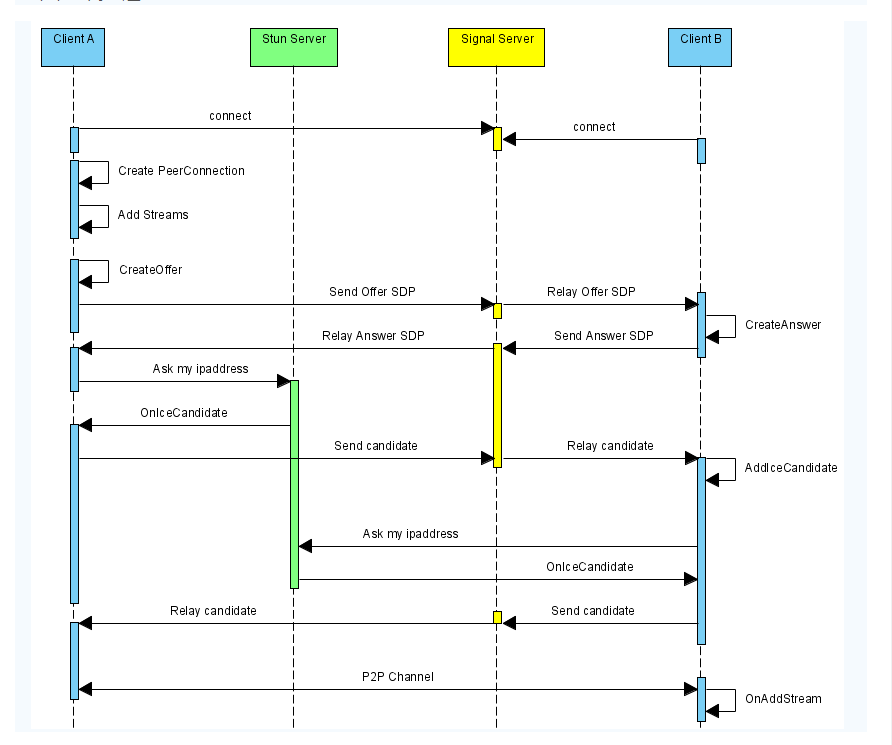

## peerconnection分析

### 流程分析

#### Client连接服务器

##### 客户端处理

+ MainWnd::OnDefaultAction里面接收用户单击“connect"的事件。

+ 委托给回调Conductor::StartLogin执行连接操作。

+ Conductor::StartLogin里再命令PeerConnectionClient::Connect执行连接操作。
  在该函数里，若服务器地址未解析，需要先解析，然后才开始连接。 当需要解析时，若PeerConnectionClient::OnResolveResult解析成功，才继续执行。

+ 当解析成功，调用PeerConnectionClient::DoConnect执行连接操作, 该函数对socket做一些相关的初始化工作。

+ 当相关的初始化工作完成后，调用PeerConnectionClient::ConnectControlSocket来向server发送连接命令。

+ 若连接成功，则回调PeerConnectionClient::OnConnect被调用, 这里准备sign_in数据包(并没有发送)，发起连接请求,连接完成会在OnConnect中发送登入命令。

+ **服务器执行相关的处理工作。**

  + 保存客户端信息，持续监测连接。

+ peer在PeerConnectionClient::OnRead(从对端获取数据触发Read事件，所以OnRead函数被触发)里接收到服务器端的数据包，并确定自己登录成功，并使用hanging_get_开始连接server。

+ 连接成功后，在PeerConnectionClient::OnHangingGetConnect里面向服务器发送/wait请求。

  ​

#### 当Peer A请求与Peer B通话时

##### Peer A部分

+ 用户在MainWnd::OnDefaultAction里触发通话命令LIST_PEERS。

+ 其在回调Conductor::ConnectToPeer里执行相关连接工作,该回调会调用InitializePeerConnection执行一些初始化工作并用CreateOffer创建发送端，设置Conductor为回调类。

+ 当Conductor创建Offer成功后, 回调Conductor::OnSuccess被调用, 该函数里面构建**一个json的sdp数据**发送给server(类型为offer)。

#####  服务器处理peer的请求和另一端聊天的数据

+ 服务器接收POST /message?peer_id=my_id&to=peer_id 信息
+ 发送SDP信息给对方

#####  Peer B部分

+ PeerConnectionClient::OnHangingGetRead会收到服务器传来的开启视频会话的命令
+ PeerConnectionClient::OnMessageFromPeer里面继续处理，交给其回调Conductor::OnMessageFromPeer来处理
  + 设置对端SDP
+ 创建响应CreateAnswer,Conductor::OnSuccess里面发送自己的sdp信息给对方


### 信令分析

#### 登入

```http
# name表示登入客户的名字
GET /sign_in?name 

# name表示登入客户的名字
GET /sign_out?name 

# my_id表示客户端的id
GET /wait?peer_id=my_id

# my_id 消息的发送方，peer_id 消息的接受方
POST /message?peer_id=my_id&to=peer_id
Body: sdp...


```


#### Peerconnection交互过程



#### 参考资料

+ [WebRTC中peerconnectclient&server 简析](https://blog.csdn.net/oldmtn/article/details/49778099)